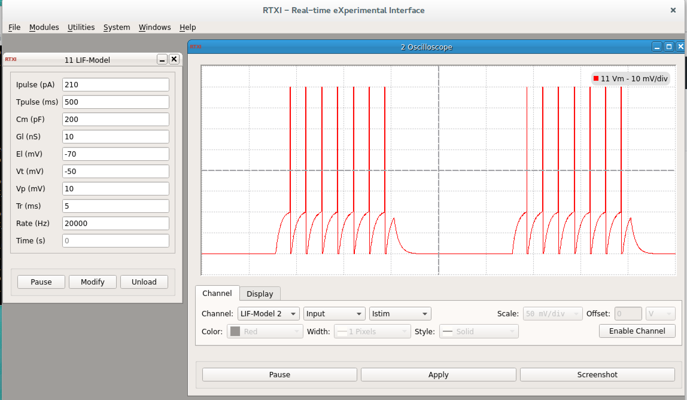

### Leaky Integrate and Fire for 

**Requirements:** None  
**Limitations:** None  

<!--start-->

This module aims at implementing the simplest spiking model of neocortical neurons: the leaky integrate-and-fire model (LIF-model). This model can then be used to mimick intracellular recordings and build experimental protocols (such as dynamics clamp, e.g. ).

The config file producing the snapshot (i.e. combined with my LIF-model implementation) can be found on this 

<!--end-->

####Parameters

see GUI 

